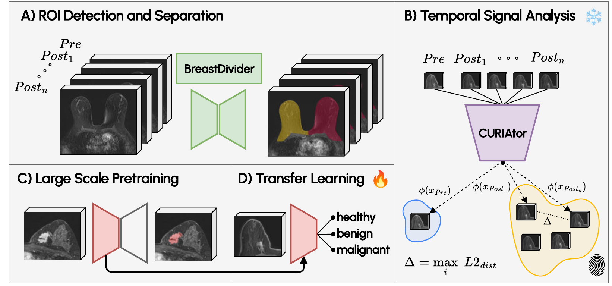
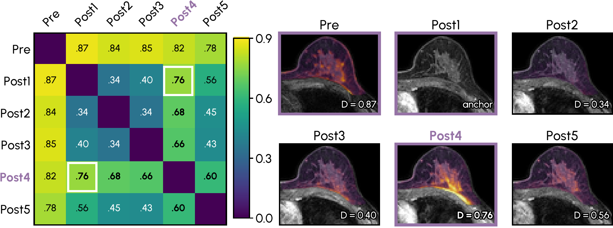

<div align="center">

# CURIAtor

**Adaptive temporal phase selection for breast DCE-MRI**

*Powered by the Curia radiology foundation model from [Raidium](https://raidium.eu/)*

[](pyproject.toml)
[](LICENSE)
[](https://huggingface.co/raidium/curia)

</div>

---

DCE-MRI protocols differ wildly across sites: number of post-contrast phases, timing, temporal
resolution. Most classifiers deal with this by hard-coding a phase subset (e.g. *Pre + Post1 + Post2*)
or by collapsing the volume into a MIP. **CURIAtor** instead looks at each acquisition in the latent
space of a frozen radiology foundation model and picks, per case and per breast, the post-contrast
phase that adds the most complementary information.

The output is a fixed-size triplet — **Pre, Post1, and the selected phase** — that a 3-channel 3D
classifier can consume. No phase labels, kinetic descriptors or assumptions
about sampling regularity are needed.

<p align="center">
  
</p>
<p align="center"><sub>Workflow overview. This repository provides phase selection. ROI masks come from
<a href="https://github.com/MIC-DKFZ/BreastDivider">BreastDivider</a>; training and pretraining are available in
<a href="https://github.com/MIC-DKFZ/MeisenMeister">MeisenMeister</a>.</sub></p>

## Highlights

- 📈 Selects a complementary post-contrast phase for each case and breast.
- 🧊 Training-free: uses the frozen [Curia](https://huggingface.co/raidium/curia) ViT-B/16 encoder without additional training.
- 🔌 Works with any number of post-contrast phases (≥ 1) and any ROI mask; CLI and Python API.

## How it works

For each acquisition and breast mask:

1. **Crop** every phase to the bounding box of the breast ROI.
2. **Embed** each axial slice with Curia to obtain patch features.
3. **Pool** features across adjacent slices to reduce sensitivity to slice misalignment.
4. **Weight** features by their overlap with the ROI to reduce background contributions.
5. **Compare** phase pairs using an ROI-weighted distance, averaged over depth.
6. **Select** the later post-contrast phase farthest from Post1 in feature space.

<p align="center">
  
</p>
<p align="center"><sub>Example phase distances and corresponding MRI slices. Post4 is farthest from
Post1 among the later phases, so the output triplet is Pre, Post1, and Post4.</sub></p>

## Installation

```bash
git clone https://github.com/MIC-DKFZ/CURIAtor.git
cd CURIAtor
pip install -e ".[plot]"
```

CURIAtor downloads [`raidium/curia`](https://huggingface.co/raidium/curia) from the Hugging Face Hub on
first use. If the model asks you to accept its terms, do so on the model page and authenticate once:

```bash
hf auth login          # or: export HF_TOKEN=hf_...
```

A CUDA GPU is recommended; CPU works but is slow.

## Quick start

### 1. Get a breast mask

CURIAtor expects a left/right breast mask on the same grid as the DCE phases. The easiest way is
[BreastDivider](https://github.com/MIC-DKFZ/BreastDivider) (labels `1 = left`, `2 = right`):

```bash
pip install breastdivider
breastdivider predict case_pre.nii.gz case_mask.nii.gz --device cuda
```

Any other label mask works too: use `--side roi` for "any non-zero voxel" or pass an integer label from Python.

### 2. Select the phase

```bash
curiator select pre.nii.gz post{1..7}.nii.gz \
    --mask case_mask.nii.gz --side both \
    --json selection.json --plot dist.png
```

```text
[left] selected post7.nii.gz (index 7), D to Post1 = 0.7965
[right] selected post7.nii.gz (index 7), D to Post1 = 0.7168
```

Phases must be passed **in temporal order, Pre first, Post1 second**. Only pass DCE phases, not T2 or
other sequences. Add `--export-dir out/ --case-id case01` to write the cropped triplet as
`case01_{left,right}_000{0,1,2}.nii.gz`, ready for training.

### 3. …or from Python

```python
from curiator import CURIAtor

curiator = CURIAtor()  # pool_size=8, device="cuda" if available
result = curiator.select(
    ["pre.nii.gz", "post1.nii.gz", "post2.nii.gz", "post3.nii.gz"],
    mask="case_mask.nii.gz",
    side="left",
)

result.selected_index      # 3  -> index into the phase list
result.triplet_indices     # (0, 1, 3)
result.distance_matrix     # (N, N) numpy array
result.bbox                # ROI bounding box (z0, z1, y0, y1, x0, x1) in RAS
result.to_dict()           # JSON-serialisable summary
```

Phases and mask can also be numpy arrays in RAS `[Z, Y, X]` order. See
[`examples/quickstart.py`](examples/quickstart.py) for a complete script.

## Batch processing a dataset

`curiator batch` runs on an nnU-Net-style folder, one file per phase:

```text
imagesTr/                     masks/
├── case001_0000.nii.gz  Pre  ├── case001.nii.gz   (or case001_0000.nii.gz)
├── case001_0001.nii.gz  Post1├── case002.nii.gz
├── case001_0002.nii.gz  Post2└── ...
├── case001_0003.nii.gz  ...
└── ...
```

```bash
curiator batch -i imagesTr -m masks -o curiator_out --side both --export --plot
# ODELIA layout stores T2 as channel 0003 -> exclude it:
curiator batch -i imagesTr -m masks -o curiator_out --ignore-channels 3 --export
```

```text
curiator_out/
├── selections.csv            case, n_phases, selected_index, selected_phase, fallback
├── distances/<case>_<side>.json   full result incl. distance matrix (also a resume cache)
├── images/<case>_<side>_000{0,1,2}.nii.gz   cropped Pre / Post1 / selected  (--export)
└── plots/<case>_<side>.png   (--plot)
```

Runs are resumable: cases with an existing `distances/*.json` are skipped. Failures (missing mask, empty
side, shape mismatch) are reported at the end instead of stopping the run.

## Implementation notes

Preprocessing and output conventions:

- **Orientation.** All images are reoriented to RAS; slices are taken along the first array axis
  (`[Z, Y, X]`). Exported crops are written in RAS with correct origin/spacing.
- **Intensity handling.** Each crop is first rescaled so its 99.9th percentile maps to ~1000 (this makes
  data stored on unusual scales, e.g. fastMRI breast, behave like everything else). Each slice is then clipped to its
  [1, 99] percentile range and scaled to [0, 1]. The Curia image processor casts numpy input to
  `int16`, so the encoder effectively sees the **brightest ~1 % of each slice**, i.e. the most strongly
  enhancing tissue. See
  [`normalize_slice`](src/curiator/encoder.py).
- **Grid.** Slices are resized to 512 × 512 by the processor; the ROI mask is bilinearly resampled to
  the same 32 × 32 token grid to obtain ROI weights.
- **Single post phase.** With only Pre + Post1 there is nothing to choose from; CURIAtor then reuses
  Post1 as the third channel, warns, and sets `fallback=True`.

## Training a classifier

CURIAtor prepares inputs for downstream classifiers.
**[MeisenMeister](https://github.com/MIC-DKFZ/MeisenMeister)** provides training and pretraining workflows
and accepts the 3-channel crops written by `curiator batch --export`.

## Development

```bash
pip install -e ".[dev]"
pytest
```

The tests replace Curia with a small deterministic encoder, so they run on CPU in seconds and need no model download.

## Citation

For now, please cite MeisenMeister:

```bibtex
@article{hamm2025meisenmeister,
  title   = {MeisenMeister: A Simple Two Stage Pipeline for Breast Cancer Classification on MRI},
  author  = {Hamm, Benjamin and Kirchhoff, Yannick and Rokuss, Maximilian and Maier-Hein, Klaus},
  journal = {arXiv preprint arXiv:2510.27326},
  year    = {2025}
}
```

## License

The code in this repository is released under the [Apache-2.0 License](LICENSE). The Curia model weights
are subject to their own license on the [Hugging Face model page](https://huggingface.co/raidium/curia).

## Acknowledgements

Developed at the [Division of Medical Image Computing](https://www.dkfz.de/en/medical-image-computing),
German Cancer Research Center (DKFZ), Heidelberg.
